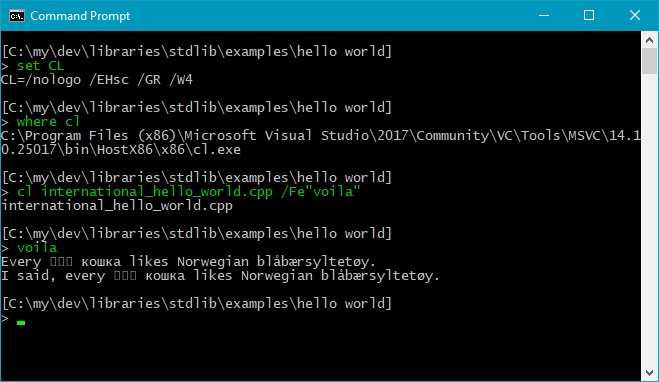

About *stdlib*.
---------------------

**Short version**:

It’s the C++ standard library with fixes, including Windows UTF-8 console i/o.

**TLDR**:

*stdlib* is a pure header library that provides

* ***fixes***  
  for some standard library issues, including that `<stdlib/iostream.hpp>` makes Windows console i/o work for international text such as Norwegian “blåbærsyltetøy” (more precisely the *Basic Multilingual Plane* of Unicode is supported), with narrow text encoded as UTF-8;

* ***C++ library header wrappers***  
  for all C++ standard library headers, e.g. if you only want the `<iostreams>` header with the Windows console i/o fix (plus some), then include `<stdlib/iostream.hpp>` instead;

* ***C library header wrappers***  
    e.g. `<stdlib/c/math.hpp>` which for maximal portability includes both `<cmath>` and `<math.h>` for you, and ditto for the other C library headers – I’ll have both, thanks!;

  

* ***functional area headers***  
  for the C++ standard, e.g. all standard library iostreams headers plus the C standard library’s i/o headers are available via `<stdlib/all/io.hpp>`, which includes all headers in this category mentioned in the [header overview at cppreference.com](http://en.cppreference.com/w/cpp/header);

* ***extensions***  
  such as `<stdlib/extension/Byte_to_wide_converter.hpp>`, which provides the class that’s used for narrow → wide encoding conversion in the Windows console i/o fix. There are no extensions other than the reusable parts of the library’s own code. But since this code is part of the library anyway, it’s provided in a reusable form.

The UTF-8 console i/o functionality in Windows is a portable implementation and is therefore for C++ iostreams only, such as `cout`, not for C level `FILE*` i/o like `printf`.

Other fixes & nice-to-have’s include • support for ANSI escape sequences, e.g. to produce colored console text, in Windows 10 and later; • setting the default locale in C and C++ to the user’s native locale, which makes the wide iostreams work for international text in \*nix-land; • setting UTF-8 as the basic execution character set (i.e. for narrow literals) in Visual C++; • support for the C++ standard’s alternative keywords such as `and`, `or` and `not`, in Visual C++; and • support for output of something that converts implicitly to `wchar const*`, on a wide stream, corresponding to how something that converts implicitly to `char const*` can be output an a narrow stream.

How to install and use *stdlib* – a short intro.
--------------------------------------------------

1. Download or clone the library.

2. Make a copy of, or possibly a link to, the library’s `source` folder. Call that copy or link `stdlib`, to make `#include`s work. Place it in a folder where your compiler looks for include files. Tip:

   * The g++ compiler checks the `CPATH` environment variable to find which folders it should look for headers in, and the Visual C++ compiler checks the `INCLUDE` environment variable.

3. Then try a simplest possible example, i.e. “Hello, world!”:

```c++
#include <stdlib/iostream.hpp>
using namespace std;

auto main() -> int
{
    cout << "Hello, world!" << endl;
}
```

When this “Hello, world!” works you have a working folder and basic tool setup.

Then

4. Test output of *international text*, e.g.

```c++
// Source encoding: utf-8 with BOM ∩
#include <stdlib/iostream.hpp>
using namespace std;

auto main() -> int
{
    cout << u8"Every 日本国 кошка likes Norwegian blåbærsyltetøy.\n";
    cout << "I said, every 日本国 кошка likes Norwegian blåbærsyltetøy.\n";
}
```

The source encoding matters. It generally needs to be UTF-8. And to make that work by default with Visual C++, a BOM (three special bytes at the start of the file) is needed. Happily modern g++ just ignores the BOM.

In this source code

* The set intersection symbol “∩” at the end of the comment is a convention that ***helps ensure UTF-8 source encoding***. It causes some editors that otherwise would have chosen some ungood encoding, to either (e.g. in the case Visual Studio) prompt you about whether to save as Unicode, or to (e.g. in the case of Notepad++) translate the “∩” to some similar looking character such as “n”. And that can reveal an ungood choice of encoding to you.

* `<stdlib/iostream.hpp>` instead of just `<iostream>` adds the general *stdlib* fixes, in particular UTF-8 console i/o in Windows.

* `u8` at the front of `u8"Every`…, explicitly requests UTF-8 encoding of this string’s data in the executable. With g++ that’s the default, but still worth testing because g++ does not validate the bytes. If this produces garbage output with g++ then the source encoding is probably not UTF-8. Note: still with all OK, on a Western PC the Chinese glyphs are likely to be *presented* as squares, because most likely the console’s font doesn’t have these glyphs.

* “日本国 кошка” are Chinese and Russian for respectively “Japanese” and “cat”. Or so I believe. “Blåbærsyltetøy” is Norwegian for blueberry jam. So the text essentially says, with non-English characters, that every Japanese cat likes Norwegian blueberry jam.

* The literal without `u8` prefix, in the last output statement, tests that the default for literals (the program’s narrow execution character set) has been correctly set as UTF-8. Since this is the default for g++ it mostly matters with Visual C++. 

The result in Windows should be like this, where `cl` is the Visual C++ compiler:



(I added coloration of the screenshot to identify the typed commands as such, but you will likely see all Windows console window text in the same color).

5. Okay. That’s it! You’re ready to go! Yay! Woohoo! Wow! Yesss!

Background &amp; goal.
----
Two C++ infra-structure developments have made *stdlib*’s “always UTF-8” a practical, instead of just an idealistic, choice:

* The upcoming C++17 *filesystem* library, part of the C++17 standard library, lets you open or create or remove files via UTF-8 encoded `char` based filenames. This complements *stdlib* in a great way. *stdlib* therefore provides access to *filesystem* already with Visual C++ 2017 and later, and with recent g++ versions, as well as any C++ implementation that supports C++17 and later.

* Visual C++, the main compiler on the Windows platform, now supports UTF-8 as the execution character set, i.e. for ordinary `char` based literals.

This means that simple novice programs, also after the first “Hello, world!”, can work well with UTF-8 console i/o in Windows. 

However, Visual C++ 2017’s  UTF-8 execution character set support is only partial. For example, command line arguments, the arguments of `main`, are encoded as Windows ANSI no matter what options you use, and output of a narrow string via a wide stream interprets it as Windows ANSI-encoded. But having UTF-8 encoded ordinary narrow literals goes 80% of the way. :)

The main goal is to enable learners and professionals who write small tool or exploratory programs, to be able to do that simply, and have those programs work with international text.

Here’s an example:

```c++
// Source encoding: utf-8 with BOM ∩
#include <stdlib/all/basics.hpp>
using namespace std;

auto main() -> int
{
    cout << "Hi, what’s your name? ";
    string name;
    getline( cin, name );
    cout << "Pleased to meet you, " << name << "!" << endl;
}
```

This same code works in both *nix-land and Windows, when the name input by the user contains non-English characters.

How can you benefit from *stdlib*?
------------------------------------------------------

With *stdlib*’s common headers, such as `<stdlib/c/math.hpp>`, or e.g. `<stdlib/all/io.hpp>`,

* there are fewer headers to include and possibly forget to include in your source code,
* portability problems due to e.g. referring unqualified to `printf` after only including `<cstdio>`, are reduced or eliminated, and
* writing small programs is a breeze compared with direct use of the standard library.

Also, it’s nice to have working international text console i/o in Windows, with ordinary `char` based text representation.

License.
-----------

[Boost Software license version 1.0](http://www.boost.org/LICENSE_1_0.txt)