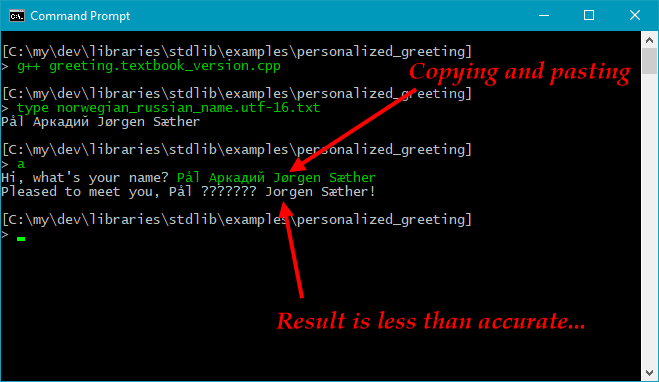
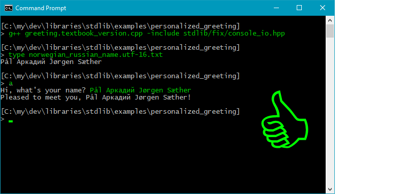

<!-- START doctoc generated TOC please keep comment here to allow auto update -->
<!-- DON'T EDIT THIS SECTION, INSTEAD RE-RUN doctoc TO UPDATE -->
*Contents:*

- [About *stdlib*.](#about-stdlib)
- [How to install and use *stdlib* – a short intro.](#how-to-install-and-use-stdlib--a-short-intro)
- [How to use *stdlib* fixes with existing code.](#how-to-use-stdlib-fixes-with-existing-code)
- [Background &amp; goal.](#background-amp-goal)
- [About the library name *stdlib*.](#about-the-library-name-stdlib)
- [How can you benefit from *stdlib*?](#how-can-you-benefit-from-stdlib)
- [License.](#license)

<!-- END doctoc generated TOC please keep comment here to allow auto update -->

About *stdlib*.
---------------------

**Short version**:

It’s the C++ standard library with UTF-8 console i/o in Windows, other crucial fixes, and functional area headers.

---

**TLDR**:

*stdlib* is a pure header library that provides

* ***fixes***  
  for some standard library issues, including that `<stdlib/fix/console_io.hpp>` makes Windows console i/o work for international text such as Norwegian “blåbærsyltetøy” (more precisely the *Basic Multilingual Plane* of Unicode is supported for the iostreams objects such as `cout`), with narrow text encoded as UTF-8;

* ***C++ library header wrappers***  
  for all C++ standard library headers, e.g. you can just include `<stdlib/iostream.hpp>` where you want the `<iostream>` header with the Windows console i/o fix, plus some;

* ***C library header wrappers***  
    e.g. `<stdlib/c/math.hpp>` which for maximal portability includes both `<cmath>` and `<math.h>` for you – I’ll have both, thanks!, and ditto for the other C library headers;

  

* ***functional area headers***  
  for the C++ standard library, e.g. just include  `<stdlib/all/io.hpp>` to get all the C++ iostreams headers plus the C standard library’s i/o headers, more precisely all headers in this category mentioned in the [header overview at cppreference.com](http://en.cppreference.com/w/cpp/header); and

* ***extensions***  
  such as `<stdlib/extension/Byte_to_wide_converter.hpp>`, which provides the class that’s used for narrow → wide encoding conversion in the Windows console i/o fix. Most of the extensions are part of the library implementation anyway, so they’re provided in a reusable form in the public interface. Those that are not directly used in the current library code, are provided for completeness.

The UTF-8 console i/o functionality in Windows is a portable iostreams buffer implementation and is therefore for C++ iostreams only, such as `cout`, not for C level `FILE*` i/o like `printf`.

Other fixes & nice-to-have’s include • support for ANSI escape sequences, e.g. to produce colored console text, in Windows 10 and later; • setting the default locale in C and C++ to the user’s native locale, which makes the wide iostreams work for international text in \*nix-land; • setting UTF-8 as the basic execution character set (i.e. for narrow literals) in Visual C++; • support for the C++ standard’s alternative keywords such as `and`, `or` and `not`, in Visual C++; and • support for output of something that converts implicitly to `wchar const*`, on a wide stream, corresponding to how something that converts implicitly to `char const*` can be output an a narrow stream.

How to install and use *stdlib* – a short intro.
--------------------------------------------------

1. Download or clone the library.

2. Make a copy of, or possibly a link to, the library’s `source` folder. Call that copy or link `stdlib`, to make `#include`s work. Place it in a folder where your compiler looks for include files. Tip:

   * The g++ compiler checks the `CPATH` environment variable to find which additional folders it should look for headers in, and the Visual C++ compiler checks the `INCLUDE` environment variable.

3. Then try a simplest possible example, i.e. “Hello, world!”:

```c++
#include <stdlib/iostream.hpp>
using namespace std;

auto main() -> int
{
    cout << "Hello, world!" << endl;
}
```

When this “Hello, world!” works you have a working folder and basic tool setup.

Then

4. Test output of *international text*, e.g.

```c++
// Source encoding: utf-8 with BOM ∩
#include <stdlib/iostream.hpp>
using namespace std;

auto main() -> int
{
    cout << u8"Every 日本国 кошка likes Norwegian blåbærsyltetøy.\n";
    cout << "I said, every 日本国 кошка likes Norwegian blåbærsyltetøy.\n";
}
```

The source encoding matters. It generally needs to be UTF-8. And to make that work by default with Visual C++, a BOM (three special bytes at the start of the file) is needed. Happily modern g++ just ignores the BOM.

In this source code

* The set intersection symbol “∩” at the end of the comment is a convention that ***helps ensure UTF-8 source encoding***. It causes some editors that otherwise would have chosen some ungood encoding, to either (e.g. in the case Visual Studio) prompt you about whether to save as Unicode, or to (e.g. in the case of Notepad++) translate the “∩” to some similar looking character such as “n”. And that can reveal an ungood choice of encoding to you.

* `<stdlib/iostream.hpp>` instead of just `<iostream>` adds the general *stdlib* fixes, in particular UTF-8 console i/o in Windows.

* `u8` at the front of `u8"Every`…, explicitly requests UTF-8 encoding of this string’s data in the executable. With g++ that’s the default, but still worth testing because g++ does not validate the bytes. If this produces garbage output with g++ then the source encoding is probably not UTF-8. Note: still with all OK, on a Western PC the Chinese glyphs are likely to be *presented* as squares, because most likely the console’s font doesn’t have these glyphs.

* “日本国 кошка” are Chinese and Russian for respectively “Japanese” and “cat”. Or so I believe. “Blåbærsyltetøy” is Norwegian for blueberry jam. So the text essentially says, with non-English characters, that every Japanese cat likes Norwegian blueberry jam.

* The literal without `u8` prefix, in the last output statement, tests that the default for literals (the program’s narrow execution character set) has been correctly set as UTF-8. Since this is the default for g++ it mostly matters with Visual C++. 

The result in Windows should be like this, where `cl` is the Visual C++ compiler:


(I added coloration of the screenshot to identify the typed commands as such, but you will likely see all Windows console window text in the same color).

5. Okay. That’s it! You’re ready to go! Yay! Woohoo!  
   Wow!  
   *Yesss*!

How to use *stdlib* fixes with existing code.
---------------------------------------------

Say you have some existing code using the C++ standard library, like this (hypothetical) textbook example program:

```c++
#include <iostream>
#include <string>
using namespace std;

auto main() -> int
{
    cout << "Hi, what's your name? ";
    string name;
    getline( cin, name );
    cout << "Pleased to meet you, " << name << "!" << endl;
}
```

In Linux or on the Mac this Just Works&trade;, due to UTF-8 encoding of narrow text as the *de facto* standard there, but in Windows, with no UTF-8 locale, there’s trouble:

<pre>
[C:\my\dev\libraries\stdlib\examples\personalized_greeting]
&gt; <i>g++ greeting.textbook_version.cpp</i>

[C:\my\dev\libraries\stdlib\examples\personalized_greeting]
&gt; <i>type norwegian_russian_name.utf-16.txt</i>
Pål Аркадий Jørgen Sæther

[C:\my\dev\libraries\stdlib\examples\personalized_greeting]
&gt; <i>a</i>
Hi, what's your name? <i>Pål Аркадий Jørgen Sæther</i>
Pleased to meet you, Pål ??????? Jorgen Sæther!

[C:\my\dev\libraries\stdlib\examples\personalized_greeting]
&gt; <i>_</i>
</pre>



You can apply the *stdlib* console i/o fix just by including the `<stdlib/fix/console_io.hpp>` header. And you can do that in the compiler invocation, as a **forced include**. I.e. there’s no need to edit the existing source code.

With g++ the `-include` option gives a forced include (with MSVC the corresponding option is `/FI`):

<pre>
[C:\my\dev\libraries\stdlib\examples\personalized_greeting]
&gt; <i>g++ greeting.textbook_version.cpp -include stdlib/fix/console_io.hpp</i>

[C:\my\dev\libraries\stdlib\examples\personalized_greeting]
&gt; <i>type norwegian_russian_name.utf-16.txt</i>
Pål Аркадий Jørgen Sæther

[C:\my\dev\libraries\stdlib\examples\personalized_greeting]
&gt; <i>a</i>
Hi, what's your name? <i>Pål Аркадий Jørgen Sæther</i>
Pleased to meet you, Pål Аркадий Jørgen Sæther!

[C:\my\dev\libraries\stdlib\examples\personalized_greeting]
&gt; _
</pre>



Yay! Old programs good as new!


Background &amp; goal.
----
Two C++ infra-structure developments have made *stdlib*’s “always UTF-8” a practical, instead of just an idealistic, choice:

* The upcoming C++17 *filesystem* library, part of the C++17 standard library, lets you open or create or remove files via UTF-8 encoded `char` based filenames. This complements *stdlib* in a great way. *stdlib* therefore provides access to *filesystem* already with Visual C++ 2017 and later, and with recent g++ versions, as well as any C++ implementation that supports C++17 and later.

* Visual C++, the main compiler on the Windows platform, now supports UTF-8 as the execution character set, i.e. for ordinary `char` based literals.

This means that simple novice programs, also after the first “Hello, world!”, can work well with UTF-8 console i/o in Windows. 

However, Visual C++ 2017 and the current MinGW g++ compiler’s UTF-8 execution character set support is only partial. For example, command line arguments, the arguments of `main`, are encoded as Windows ANSI no matter what options you use, with both MSVC and g++, and output of a narrow string via a wide stream interprets it as Windows ANSI-encoded, with both MSVC and g++. But having UTF-8 encoded ordinary narrow literals goes 80% of the way. :)

The main goal is to enable learners and professionals who write small tool or exploratory programs, to be able to do that simply, and have those programs work with international text.

Here’s an example:

```c++
// Source encoding: utf-8 with BOM ∩
#include <stdlib/all/basics.hpp>
using namespace std;

auto main() -> int
{
    cout << "Hi, what’s your name? ";
    string name;
    getline( cin, name );
    cout << "Pleased to meet you, " << name << "!" << endl;
}
```

This same code works in both *nix-land and Windows, when the name input by the user contains non-English characters.

About the library name *stdlib*.
---------------

*stdlib* started as a folder in the source tree of another project, where it was named for what it contained: access to the C++ standard library with necessary fixes applied, and nothing else.

It would be much work to change the name, and it fits (the library doesn't provide much more than just what a more practically usable definition and implementation of the C++ standard library would), so I kept it.

C++ programmers are generally quite intelligent and have to deal with multiple meanings of terms all the time, so there’s little or no risk of confusion. But I think the name can possibly lead to discussion among beginners. So, to be more precise than the in-short explanation at the beginning of this document: *stdlib* is a convenient way to access the implementation of the C++ standard library that your compiler provides, with a number of fixes applied, and with functional area headers.

How can you benefit from *stdlib*?
------------------------------------------------------

* Command line tools built with *stdlib* can handle general Unicode text in Windows, which is likely to improve productivity,
* the functional area headers means there are fewer headers to include and possibly forget to include in your source code, e.g. just using `<stdlib/all/basics.hpp>` instead of direct use of (a large number of C++ standard library headers including) `<string>`, `<vector>`, `<stdlib.h>`, `<stdexcept>`, `<iostream>`, `<iomanip` etc. etc.,
* *stdlib*, or an equivalent library, reduces or eliminates portability problems due to e.g. referring unqualified to `printf` after only including `<cstdio>`,
* the functional area headers also support use of a precompiled header to speed up builds, with `<stdlib/all/of_it.hpp>` playing the rôle of g++’s `<bits/stdc++.h>`, and
* *stdlib* is a single point of indirection where you can centralize all your fixes of problems with various C++ standard library implementations, and where such fixes can be provided in new versions of the library.

Also, it’s nice to have portable code where ordinary `char` based international text console i/o works in Windows.

And hey, ANSI escape sequences, cool. :smiley:

License.
-----------

[Boost Software license version 1.0](http://www.boost.org/LICENSE_1_0.txt)
